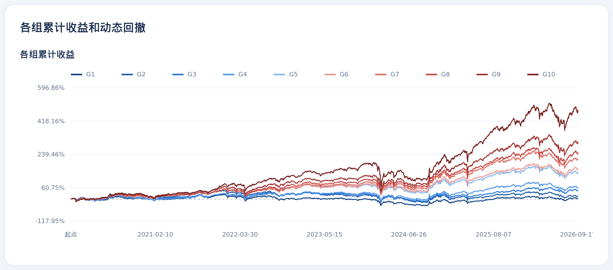
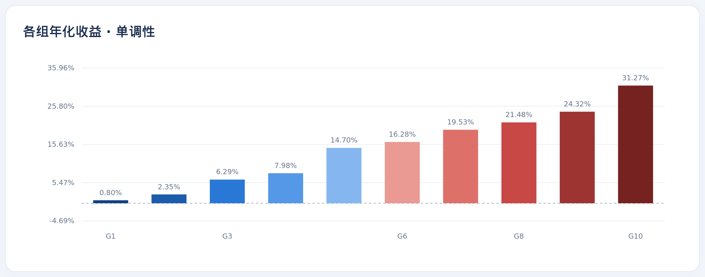
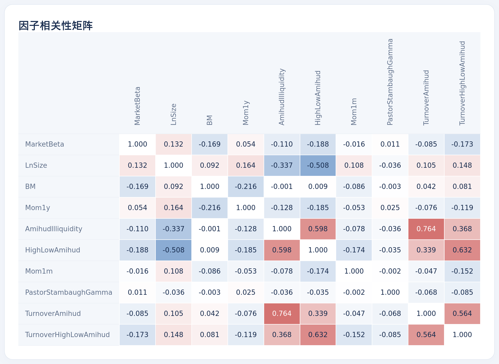

# A 股因子研究

基于分钟和日线行情的 A 股选股因子研究框架。完整流程是：整理行情 → 构建高频和中频因子 → 分组回测、计算 IC → 输出交互式 HTML 报告和每日多头持仓清单。

```text
原始 CSV ──数据更新──▶ 分钟 / 日线 / 财务 parquet ──因子构建──▶ 每个因子一个 parquet ──因子评估──▶ 指标 CSV + HTML 报告 + 持仓清单
```

## 快速开始

1. 复制 `config_local.example.json`，命名为 `config_local.json`，把 `root_dir` 设为代码目录和 `a_share_market_data/` 共同的上级目录。配置里以 `_dir` / `_path` 结尾的字段都相对这个目录解析。
2. 在 [main.py](main.py) 中修改 `CONFIG_FILE` 选择任务，然后运行 `python main.py`。

| 任务 | `CONFIG_FILE` | 入口类 |
| --- | --- | --- |
| 数据更新 | `portfolio_20260905/config/config_data_update.json` | `DataUpdater` |
| 因子构建 | `portfolio_20260905/config/config_factor_construction.json` | `HighFreqFactorConstructor` / `MiddleFreqFactorConstructor` |
| 因子评估 | `portfolio_20260905/config/config_factor_evaluation.json` | `SingleFactorEvaluation` / `MultiFactorEvaluation` |

第一次使用时按表格顺序执行。仓库不含行情数据，需要自行准备。三个任务都有 `update_all` 字段：设为 `1` 时全量重算并覆盖结果，设为 `0` 时只补算缺失的日期。

依赖：pandas、numpy、pyarrow、matplotlib、tqdm。

## 目录结构

```text
main.py                  # 入口与配置加载
config/                  # 三类任务的配置
update_data/             # 行情整理、复权、生成回测数据
construct_asset_pool/    # 下载股票基础信息与交易日历（单独运行）
factors/construction/    # 因子构建器与因子实现（高频 / 中频）
factors/evaluation/      # 单因子与批量评估、相关性分析、HTML 报告
factor_list.csv          # 高频因子清单及算子公式
```

## 数据更新

从 `new_data_dir` 读取 `daily_minutes.csv`、`stock_exrights.csv`、`limit_price.csv`、`stock_st_status.csv`、`mkcap.csv` 和 `fundamentals_quarterly.csv`，结果写到 `output_dir`：

| 输出 | 内容 |
| --- | --- |
| `stock_minutes/<年>/<日期>.parquet` | 按交易日拆分的分钟行情 |
| `stock_daily/daily_stock_data.parquet` | 后复权日线 OHLC，附当日总市值 `mkcap`（元） |
| `stock_daily/daily_stock_data_10am.parquet` | 每日 10:00 后复权价格，作为回测成交价 |
| `fundamentals/financial_data.parquet` | 季度财报，流量变量转为 TTM，以公告日为 `date` |
| `fundamentals/`、`limit_price/`、`stock_st_status/` | 日度和月度市值、涨跌停价、ST 状态 |

## 因子构建

`construction_mode` 取 `high`（高频）或 `middle`（中频）。`factor_list` 和 `middle_factor_list` 分别列出要计算的高频、中频因子，留空表示计算对应目录下的全部因子。

| 类型 | 输入 | 因子举例 |
| --- | --- | --- |
| 高频 | 当日分钟行情 | 分时段动量、开盘和尾盘成交占比、分钟收益偏度和峰度、量价相关性、上行和下行波动率等，完整清单见 [factor_list.csv](factor_list.csv) |
| 中频 | 历史日线和财务数据 | `LnSize`、`BM`、`MarketBeta`、`Mom1m`、`Mom1y`、`AmihudIlliquidity` 及其变体、`PastorStambaughGamma` |

- 股票池剔除 ST 股，以及连续交易不满 250 天的股票。
- 每个因子额外输出 5、20、60、120、250 日滚动均值列（如 `Mom1m_250_m`）。评估时，这些列也作为独立因子。
- 新增因子的方法：在 [high_freq_factor_calculation/](factors/construction/high_freq_factor_calculation/) 或 [middle_freq_factor_calculation/](factors/construction/middle_freq_factor_calculation/) 下新建与类名同名的文件，继承 `_BaseHighFreqFactor` 或 `_BaseMiddleFreqFactor`，实现 `calculate()`，返回 `code`、`date` 和因子列。构建器按文件名自动注册。

## 因子评估

`evaluation_mode` 设为 `single` 时，只评估 `specified_column` 指定的一列；设为 `multi` 时，评估因子目录下的所有列。评估口径如下：

- **股票池**：按 `stock_board`（`main board` 或 `all`）筛选板块，再按上月末市值每日保留最小的 `stock_pool` 只股票。
- **收益**：因子值滞后一天使用，当日 10:00 买入，持有到下一交易日 10:00。
- **持有期**：`holding_periods` 设定持有的交易日数（默认 1、5、10、20 天）。持有 N 天时每个交易日买入一批、同时持有最近 N 批，各批等权，组合日收益取各批当日收益的均值；IC 和 RankIC 用之后 N 天的复利累计收益计算，换手率折算为日均口径。持有 1 天的结果始终计算，持仓清单和批量指标汇总都基于它。
- **分组**：每日按因子值等分为 `group_number` 组，计算各组收益、IC、RankIC 和换手率。IC 均值为正时做多因子值最高的组，否则做多最低的组。不计交易成本。
- **多因子分析**：批量模式还会计算全部原始因子的截面相关性矩阵，并对 `base_factor_list` 中的基础因子做截面回归，计算它们对其他因子的解释度 R²。

输出默认位于 `a_share_market_data/factors_evaluation_output/`：

| 路径 | 内容 |
| --- | --- |
| `numerical_output/<因子列>.csv` | 每日分组收益、IC、RankIC、股票数、换手率；持有 1 天以外的列加 `_<N>d` 后缀，如 `group_1_5d`、`IC_5d` |
| `numerical_output/factor_comparison.csv` | 批量模式的指标汇总 |
| `visualization_output/single_factor_evaluation/<因子>_report.html` | 单因子交互式报告，每个因子一份，合并原始值、各滚动均值列和各持有期：窗口对比、持有期对比、窗口详情、分年表现 |
| `visualization_output/multi_factor_evaluation_report.html` | 批量模式报告：指标对比、相关性矩阵、R² 曲线；点击因子后在页面底部嵌入该因子的单因子报告 |
| `stock_list/<因子列>.csv` | 历史每日多头持仓 |
| `stock_list/next_day/<因子列>.csv` | 由最新收盘信号得到的下一交易日目标持仓 |

持仓清单会附上 `__daily_data_update/stock_info.csv` 中的股票名称、行业等信息。

## 结果示例

### AmihudIlliquidity 单因子报告

Amihud 非流动性 = 日收益率绝对值 / 当日成交额。评估区间为 2020-01-02 至 2026-09-17，样本为主板市值最小的 2000 只股票，每日分 10 组：

| IC 均值 | RankIC 均值 | ICIR | 多头（G10）年化收益 | 多空年化收益 | 多头日均换手率 |
| --- | --- | --- | --- | --- | --- |
| 0.011 | 0.030 | 0.14 | 31.3% | 29.4% | 61.8% |





从 G1 到 G10，年化收益单调上升，非流动性越高的组收益越高。以上收益未计手续费和滑点；多头组日均换手率约 62%，扣除成本后的实际收益会明显更低。

### 因子相关性矩阵

下图取自批量评估报告，数值为每日截面 Pearson 相关系数的时间均值。前 4 个是基础因子 `MarketBeta`、`LnSize`、`BM`、`Mom1y`。



Amihud 类因子之间高度相关（如 `AmihudIlliquidity` 与 `TurnoverAmihud` 为 0.76）。其中 `AmihudIlliquidity` 和 `HighLowAmihud` 与市值明显负相关，分别为 −0.34 和 −0.51。
